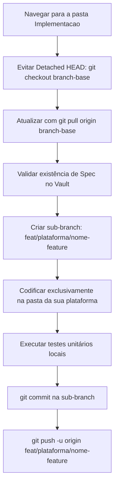

# Guia de Contribuição e Instruções Git para a Equipe

> Este documento estabelece o guia prático e obrigatório de versionamento Git para todos os desenvolvedores atuando nos subsistemas **Web**, **Desktop** e **Mobile** do projeto PIM IV.

---

## 1. Entendendo a Arquitetura de Repositórios

O projeto utiliza o modelo de **Repositório Agregador com Git Submodules**. Isso significa que o repositório raiz funciona como um orquestrador que conecta dois repositórios independentes no GitHub:

```text
<raiz-do-projeto>/PIM/
├── .gitmodules             <- Mapeamento dos submódulos remotos
├── GIT-INSTRUCTIONS.md     <- Este guia prático de versionamento
├── Documentacao/           <- Relatórios acadêmicos e diagramas formais do PIM
├── Implementacao/          <- [SUBMÓDULO: PIMIV_Implementacao] Código-fonte (Web, Desktop, Mobile)
│   ├── WEB/                <- Aplicação Web (ASP.NET Core MVC)
│   ├── DESKTOP/            <- Aplicação Desktop (PDV / Frente de Caixa)
│   └── MOBILE/             <- Aplicação Mobile
└── Vault/                  <- [SUBMÓDULO: PIMIV_Vault] Fonte Única da Verdade (SSOT)
    ├── 00-Meta/            <- Governança, Políticas e Modelos (Specs/ADRs)
    ├── 01-Core-Domain/     <- Regras de Negócio Universais e Contratos de API
    ├── 02-Legacy-Analysis/ <- Mapeamento e débitos do sistema legado
    ├── 03-Systems/         <- Especificações técnicas particionadas por cliente
    ├── 04-Specs-Backlog/   <- Ciclo de vida de aprovação de features
    └── 05-Architecture-Knowledge/ <- Registro de ADRs e Pesquisas Técnicas
```

### Regra Fundamental de Contexto de Comandos
* **Trabalho em Código-Fonte**: Qualquer comando Git referente a código (`git checkout`, `git add`, `git commit`, `git push`) deve ser executado **dentro do diretório `Implementacao/`**.
* **Trabalho em Documentação e Specs**: Comandos de governança e documentação devem ser executados **dentro do diretório `Vault/`**.
* **Repositório Agregador (`PIM/`)**: Utilizado apenas para sincronizar os apontamentos de versão dos dois submódulos.

---

## 2. Como Clonar e Inicializar o Ambiente de Trabalho

### 2.1. Clonagem Inicial com Submódulos Populados
Para clonar o projeto completo garantindo que as pastas `Implementacao/` e `Vault/` venham com seus conteúdos preenchidos:

```bash
git clone --recurse-submodules https://github.com/FeronZerbana/PIMIV.git
cd PIM
```

### 2.2. Inicialização Tardia (Caso Tenha Clonado sem `--recurse-submodules`)
Se o repositório pai foi clonado de forma simples e as pastas dos submódulos estiverem vazias, execute na raiz do projeto:

```bash
cd <caminho-do-repositorio>/PIM
git submodule update --init --recursive
```

---

## 3. Topologia de Branches e Atribuição de Responsabilidades

No submódulo `Implementacao`, o ciclo de vida do código é segregado entre plataformas para permitir desenvolvimento concorrente sem bloqueios mútuos:

| Branch | Responsabilidade | Quem Atua |
| :--- | :--- | :--- |
| `production` | Versão final consolidada, estável e homologada | Integração final de entrega |
| `develop` | Branch de integração contínua e resolução de conflitos | Toda a equipe |
| `feat/web` | Branch base de desenvolvimento da plataforma Web | Desenvolvedores Web |
| `feat/desktop` | Branch base de desenvolvimento da plataforma Desktop | Desenvolvedores Desktop |
| `feat/mobile` | Branch base de desenvolvimento da plataforma Mobile | Desenvolvedores Mobile |

---

## 4. Como Trabalhar em sua Plataforma (Foco Prático)

Esta seção detalha o fluxo operacional diário para cada desenvolvedor, desde a preparação do ambiente local até a submissão de alterações para revisão.



---

### 4.1. Passo Inicial Obrigatório: Entrar no Submódulo de Código
Abra o terminal e posicione-se no diretório de código-fonte:

```bash
cd <caminho-do-projeto>/PIM/Implementacao
```

---

### 4.2. Prevenção Crítica: O Estado de Detached HEAD
Por padrão, ao atualizar submódulos, o Git pode posicionar o repositório em um commit específico desvinculado de qualquer branch ativa (chamado de `HEAD desanexada` ou `detached HEAD`).

Se você fizer commits em estado de `detached HEAD`, **seus commits não pertencerão a nenhuma branch e poderão ser perdidos**.

**Como verificar e corrigir**:
1. Execute `git status`.
2. Se a mensagem indicar `HEAD detached at ...`, reposicione-se imediatamente na branch base da sua equipe antes de realizar qualquer alteração:
   * **Equipe Web**: `git checkout feat/web`
   * **Equipe Desktop**: `git checkout feat/desktop`
   * **Equipe Mobile**: `git checkout feat/mobile`

---

### 4.3. Fluxo de Trabalho do Desenvolvedor WEB

A equipe Web é responsável pela aplicação e-commerce em **ASP.NET Core MVC** localizada em `Implementacao/WEB/`.

#### Passo a Passo para Nova Feature Web:
1. **Posicione-se e atualize a branch base da Web**:
   ```bash
   git checkout feat/web
   git pull origin feat/web
   ```
2. **Crie sua branch de feature derivada de `feat/web`**:
   * Padrão: `feat/web/<identificador-ou-nome-da-tarefa>`
   * Exemplo:
     ```bash
     git checkout -b feat/web/catalogo-produtos-mvc
     ```
3. **Desenvolva o código**:
   * Crie Controllers, ViewModels e Razor Views exclusivamente dentro de `Implementacao/WEB/`.
   * Consulte as regras de precificação e validações em `Vault/01-Core-Domain/Business-Rules.md`.
4. **Verifique o status das alterações**:
   ```bash
   git status
   ```
5. **Realize o commit**:
   ```bash
   git add WEB/
   git commit -m "feat(web): implementacao da listagem e filtros do catalogo de produtos"
   ```
6. **Suba para o repositório remoto**:
   ```bash
   git push -u origin feat/web/catalogo-produtos-mvc
   ```

---

### 4.4. Fluxo de Trabalho do Desenvolvedor DESKTOP

A equipe Desktop é responsável pela aplicação de **Ponto de Venda (PDV / Frente de Caixa)** e comunicação com periféricos locais, localizada em `Implementacao/DESKTOP/`.

#### Passo a Passo para Nova Feature Desktop:
1. **Posicione-se e atualize a branch base do Desktop**:
   ```bash
   git checkout feat/desktop
   git pull origin feat/desktop
   ```
2. **Crie sua branch de feature derivada de `feat/desktop`**:
   * Padrão: `feat/desktop/<identificador-ou-nome-da-tarefa>`
   * Exemplo:
     ```bash
     git checkout -b feat/desktop/modulo-impressora-termica
     ```
3. **Desenvolva o código**:
   * Implemente a interface do PDV, rotinas de leitor de código de barras e emissores de cupom não-fiscal dentro de `Implementacao/DESKTOP/`.
   * Siga as especificações de hardware descritas em `Vault/03-Systems/Desktop/README.md`.
4. **Verifique o status das alterações**:
   ```bash
   git status
   ```
5. **Realize o commit**:
   ```bash
   git add DESKTOP/
   git commit -m "feat(desktop): integracao do driver de impressao termica esc-pos"
   ```
6. **Suba para o repositório remoto**:
   ```bash
   git push -u origin feat/desktop/modulo-impressora-termica
   ```

---

### 4.5. Fluxo de Trabalho do Desenvolvedor MOBILE

A equipe Mobile é responsável pelo aplicativo do cliente (com suporte offline e notificações push), localizado em `Implementacao/MOBILE/`.

#### Passo a Passo para Nova Feature Mobile:
1. **Posicione-se e atualize a branch base do Mobile**:
   ```bash
   git checkout feat/mobile
   git pull origin feat/mobile
   ```
2. **Crie sua branch de feature derivada de `feat/mobile`**:
   * Padrão: `feat/mobile/<identificador-ou-nome-da-tarefa>`
   * Exemplo:
     ```bash
     git checkout -b feat/mobile/carrinho-offline-storage
     ```
3. **Desenvolva o código**:
   * Implemente componentes de interface, persistência local e sincronização dentro de `Implementacao/MOBILE/`.
   * Respeite os contratos de API unificados definidos em `Vault/01-Core-Domain/API-Contracts/`.
4. **Verifique o status das alterações**:
   ```bash
   git status
   ```
5. **Realize o commit**:
   ```bash
   git add MOBILE/
   git commit -m "feat(mobile): persistencia local do carrinho para navegacao offline"
   ```
6. **Suba para o repositório remoto**:
   ```bash
   git push -u origin feat/mobile/carrinho-offline-storage
   ```

---

### 4.6. Checklist de Validação Pré-Desenvolvimento
Antes de iniciar qualquer codificação em qualquer plataforma:
- [ ] A funcionalidade possui especificação validada em `Vault/04-Specs-Backlog/Active/`? (Regra: Proibido Código Sem Spec).
- [ ] O terminal está posicionado dentro de `Implementacao/`?
- [ ] A branch base da sua plataforma foi atualizada via `git pull`?
- [ ] A nova branch foi criada com o prefixo correto (`feat/web/...`, `feat/desktop/...`, `feat/mobile/...`)?

---

## 5. Padrão de Commits

### 5.1. Diretrizes de Mensagem
Adotamos o padrão Conventional Commits em português, mantendo a escrita técnica, formal e **sem emojis**:

* `feat(<escopo>): <descrição>` - Nova funcionalidade baseada em especificação.
* `fix(<escopo>): <descrição>` - Correção de defeito ou inconsistência.
* `refactor(<escopo>): <descrição>` - Refatoração estrutural sem mudança de comportamento.
* `test(<escopo>): <descrição>` - Implementação de testes unitários ou de integração.
* `chore(<escopo>): <descrição>` - Configurações de build, dependências ou scripts.
* `docs(<escopo>): <descrição>` - Documentações técnicas e especificações.

**Escopos aceitos**: `web`, `desktop`, `mobile`, `core`, `api`, `adr`, `vault`.

---

## 6. Como Fazer Push para Branches Específicas

### 6.1. Primeiro Push (Configurando Upstream)
Ao enviar uma sub-branch de feature pela primeira vez:

```bash
git push -u origin feat/web/minha-feature
```

### 6.2. Pushes Subsequentes
Nas próximas atualizações da mesma branch:

```bash
git push origin feat/web/minha-feature
```

---

## 7. Perigos Críticos e Cuidados Necessários

### 7.1. Perigo 1: Comitar na Raiz `PIM/` em vez de `Implementacao/`
* **Causa**: Estar na pasta errada ao executar `git add .` e `git commit`.
* **Impacto**: O repositório pai apenas registrará uma alteração de metadados do submódulo, mas os arquivos de código-fonte não serão commitados no repositório de implementação.
* **Prevenção**: Observe o prompt do terminal ou execute `pwd` / `Get-Location` para garantir que está dentro de `Implementacao/`.

### 7.2. Perigo 2: Uso Destrutivo de `git push --force`
* **Causa**: Forçar a reescrita de histórico em branches compartilhadas (`develop`, `production`, `feat/web`, `feat/desktop`, `feat/mobile`).
* **Impacto**: Sobrescreve e apaga o trabalho de outros desenvolvedores que já enviaram commits para o GitHub.
* **Prevenção**:
  * É **estritamente proibido** utilizar `--force` em branches compartilhadas.
  * Em sub-branches pessoais de feature, utilize exclusivamente `--force-with-lease` caso tenha realizado rebase local.

### 7.3. Perigo 3: Conflitos por Falta de Sincronização Periódica
* **Causa**: Passar múltiplos dias trabalhando isolado sem integrar as mudanças da branch base da plataforma.
* **Impacto**: Conflitos complexos e demorados no momento de integrar a funcionalidade.
* **Prevenção**: Ao menos uma vez ao dia, integre a branch base na sua branch de feature:
  ```bash
  git checkout feat/web
  git pull origin feat/web
  git checkout feat/web/minha-feature
  git merge feat/web
  ```

---

## 8. Como Atualizar o Repositório Agregador (PIM)

Quando novas versões de código em `Implementacao/` ou de documentação em `Vault/` forem concluídas e homologadas, o repositório pai `PIM/` deve ter seus apontadores atualizados:

```bash
# 1. Navegue para a raiz do repositório pai
cd <caminho-do-repositorio>/PIM

# 2. Verifique o status
git status

# 3. Adicione os submódulos atualizados
git add Implementacao Vault
git commit -m "chore: atualizacao dos ponteiros dos submodulos Implementacao e Vault"

# 4. Envie para o repositorio remoto do PIM
git push origin master
```

---

## 9. Guia de Resolução de Problemas Comuns (Troubleshooting)

### Cenário A: Cometi alterações em estado de `detached HEAD`
```bash
# 1. Crie temporariamente uma branch com seus commits atuais
git branch branch-temporaria

# 2. Mude para a branch base correta
git checkout feat/web   # ou feat/desktop / feat/mobile
git pull origin feat/web

# 3. Crie sua branch definitiva e aplique as alteracoes da branch temporaria
git checkout -b feat/web/minha-feature
git merge branch-temporaria

# 4. Exclua a branch temporaria
git branch -D branch-temporaria
```

### Cenário B: Comitei na branch errada localmente (antes do push)
```bash
# 1. Desfaca o commit mantendo os arquivos intactos na area de trabalho
git reset --soft HEAD~1

# 2. Mude para a branch correta
git checkout -b feat/web/nome-correto

# 3. Faca o commit no destino correto
git add .
git commit -m "feat(web): descricao da feature"
```

### Cenário C: O submódulo de outro colega não atualiza na minha máquina
```bash
# Na raiz do repositorio pai
cd <caminho-do-repositorio>/PIM
git pull origin master
git submodule update --recursive
```
